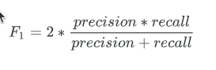
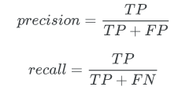

# Natural Language Processing with Disaster Tweets
### Predict which Tweets are about real disasters and which ones are not

link: <https://www.kaggle.com/competitions/nlp-getting-started/overview>

# Overview

This competition runs indefinitely with a rolling leaderboard. Learn more

# Description
### Welcome to one of our "Getting Started" competitions 👋
This particular challenge is perfect for data scientists looking to get started with Natural Language Processing. The competition dataset is not too big, and even if you don’t have much personal computing power, you can do all of the work in our free, no-setup, Jupyter Notebooks environment called Kaggle Notebooks.

**If you want to talk with other users about this competition, come join our Discord! We've got channels for competitions, job postings and career discussions, resources, and socializing with your fellow data scientists. Follow the link here:** https://discord.gg/kaggle

### Competition Description
Twitter has become an important communication channel in times of emergency.
The ubiquitousness of smartphones enables people to announce an emergency they’re observing in real-time. Because of this, more agencies are interested in programatically monitoring Twitter (i.e. disaster relief organizations and news agencies).

But, it’s not always clear whether a person’s words are actually announcing a disaster. Take this example:


The author explicitly uses the word “ABLAZE” but means it metaphorically. This is clear to a human right away, especially with the visual aid. But it’s less clear to a machine.

In this competition, you’re challenged to build a machine learning model that predicts which Tweets are about real disasters and which one’s aren’t. You’ll have access to a dataset of 10,000 tweets that were hand classified. If this is your first time working on an NLP problem, we've created a quick tutorial to get you up and running.

Disclaimer: The dataset for this competition contains text that may be considered profane, vulgar, or offensive.

**💡Getting Started Notebook**
To get started quickly, feel free to take advantage of this starter notebook.

### Acknowledgments
This dataset was created by the company figure-eight and originally shared on their ‘Data For Everyone’ website here.

Tweet source: https://twitter.com/AnyOtherAnnaK/status/629195955506708480


---------------------------------------------------------
# Evaluation
Submissions are evaluated using F1 between the predicted and expected answers.

F1 is calculated as follows:


where:


and:

```
True Positive [TP] = your prediction is 1, and the ground truth is also 1 - you predicted a positive and that's true!
False Positive [FP] = your prediction is 1, and the ground truth is 0 - you predicted a positive, and that's false.
False Negative [FN] = your prediction is 0, and the ground truth is 1 - you predicted a negative, and that's false.
```

## Submission File
For each ID in the test set, you must predict 1 if the tweet is describing a real disaster, and 0 otherwise. The file should contain a header and have the following format:

```
id,target
0,0
2,0
3,1
9,0
11,0
```
--------------------------------------------

## FAQ
#### What is a Getting Started competition?
Getting Started competitions were created by Kaggle data scientists for people who have little to no machine learning background. They are a great place to begin if you are new to data science or just finished a MOOC and want to get involved in Kaggle.

Getting Started competitions are a non-competitive way to get familiar with Kaggle’s platform, learn basic machine learning concepts, and start meeting people in the community. They have no cash prize and are on a rolling timeline.

#### What’s the difference between a private and public leaderboard?
In this competition, because it is a Getting Started competition, there is no difference. We're scoring the entire test set on the Public Leaderboard. And we will refresh the competition every two months, so the Private Leaderboard is irrelevant.

For non-Getting Started Kaggle competitions, there is the concept of a public and private leaderboard to prevent participants from “overfitting” to the leaderboard. If your model is “overfit” to a dataset then it is not generalizable outside of the dataset you trained it on. This means that your model would have low accuracy on another sample of data taken from a similar dataset.

#### Why are there perfect scores on the leaderboard?
This competition's test set labels are completely public. So it's likely that some participants will submit perfect submissions. Since there are no prizes, medals, or points associated with your leaderboard ranking in this competition, these scores have little consequence. The rankings are purely for the benefit of users to learn and see how their approach is improving.

"Then can you just clear them out? They're distracting." It's a heavily time-intensive process to manage removals from a continuously live leaderboard. The threshold for what should be removed also becomes arbitrary -- if you remove 1.00 scores, then .99 scores will quickly appear. Since there is no prize consequence, we have chosen to leave the scores as an open sandbox.

#### How do I create and manage a team?
When you accept the competition rules, a team will be created for you. You can invite others to your team, accept a merger with another team, and update basic information like team name by going to the Team page.

We've heard from many Kagglers that teaming up is the best way to learn new skills AND have fun. If you don't have a teammate already, consider asking if anyone wants to team up in the discussion forum.

#### What are Notebooks?
Kaggle Notebooks is a cloud computational environment that enables reproducible and collaborative analysis. Kernels supports scripts in R and Python, Jupyter Notebooks, and RMarkdown reports. Go to the Notebooks tab to view all of the publicly shared code on this competition. For more on how to use Notebooks to learn data science, visit Kaggle's Learn Courses.

#### Why did my team disappear from the leaderboard?
To keep with the spirit of getting-started competitions, we have implemented a two month rolling window on submissions. Once a submission is more than two months old, it will be invalidated and no longer count towards the leaderboard.

If your team has no submissions in the previous two months, the team will also drop from the leaderboard. This will keep the leaderboard at a manageable size, freshen it up, and prevent newcomers from getting lost in a sea of abandoned scores.

"I worked so hard to get that score! Give it back!" Read more about our decision to implement rolling leaderboards, covered in the Titanic Getting Started Competition forum here.

#### How do I contact Support?
Kaggle does not have a dedicated support team so you’ll typically find that you receive a response more quickly by asking your question in the appropriate forum. (For this competition, you’ll want to use this competition's discussion forum.

Support is only able to help with issues that are being experienced by all participants. Before contacting support, please check the discussion forum for information on your problem. If you can’t find it, you can post your problem in the forum so a fellow participant or a Kaggle team member can provide help. The forums are full of useful information on the data, metric, and different approaches. We encourage you to use the forums often. If you share your knowledge, you'll find that others will share a lot in turn!

If your problem persists or it seems to be effective all participants then please contact us.

------------------------------------------

# Citation
Addison Howard, devrishi, Phil Culliton, and Yufeng Guo. Natural Language Processing with Disaster Tweets. https://kaggle.com/competitions/nlp-getting-started, 2019. Kaggle.